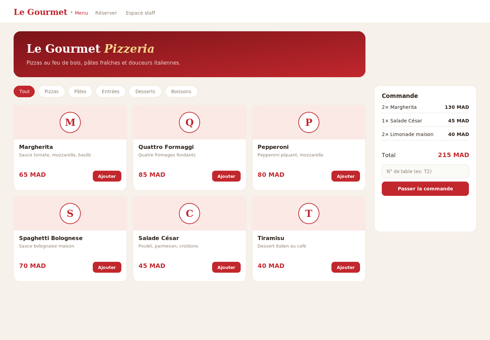
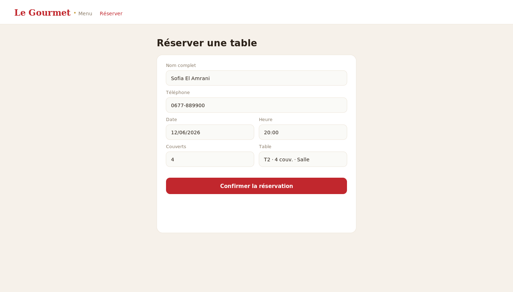
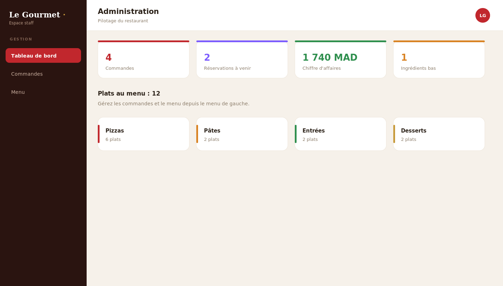
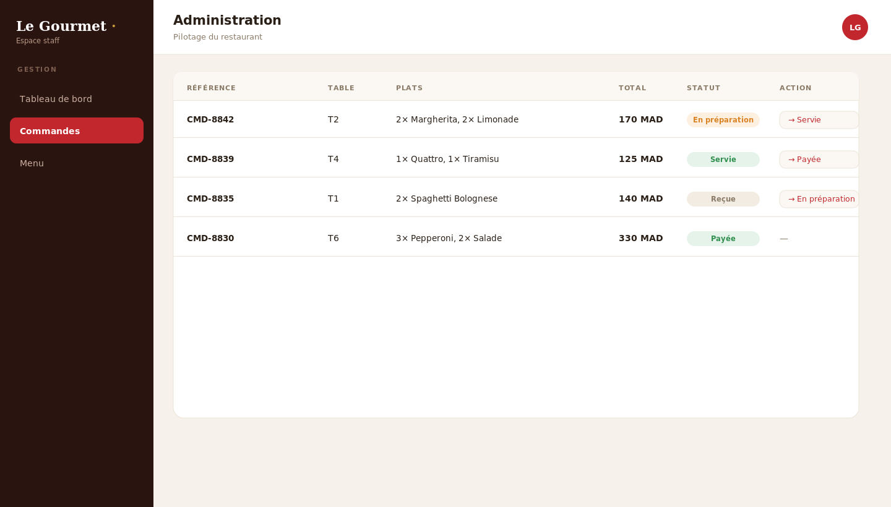

# Le Gourmet — Système de gestion de restaurant (pizzeria)

Application de gestion pour une pizzeria : **espace client** (menu, réservation de table) et **espace administrateur** (commandes, menu, réservations, stock). Projet de fin d'année (PFA). Backend **Spring Boot + Hibernate** sur **MySQL**, frontend **React (Vite)**.

> Projet académique de Badr Chigar — Ingénieur d'État en Informatique (EMSI Casablanca).

## Captures d'écran

### Menu (espace client)


### Réservation de table


### Tableau de bord (admin)


### Gestion des commandes


## Fonctionnalités

**Espace client**
- Carte du restaurant filtrable (pizzas, pâtes, entrées, desserts, boissons).
- Réservation de table en ligne (date, heure, nombre de couverts).

**Espace administrateur**
- Tableau de bord (commandes du jour, réservations, chiffre d'affaires).
- Gestion du menu (CRUD des plats).
- Suivi des commandes avec statut (`reçue → en préparation → servie → payée`).
- Gestion des réservations et des tables.
- Suivi du stock des ingrédients.

## Stack
| Couche | Technologies |
|--------|--------------|
| Frontend | React 18, Vite, React Router |
| Backend | Spring Boot 2.7, Spring Data JPA, Hibernate |
| Base de données | MySQL (H2 en mémoire pour la démo) |

## Architecture
```
legourmet/
├── backend/   API REST Spring Boot + Hibernate
│   └── src/main/java/ma/legourmet/
│       ├── model/        Plat, Commande, LigneCommande, Reservation, Table, Ingredient
│       ├── repository/   Spring Data JPA
│       ├── controller/   Plat, Commande, Reservation, Stats
│       └── config/       CORS + données de démo
└── frontend/  SPA React (Vite)
    └── src/pages/  Menu, Reservation, AdminDashboard, AdminCommandes, AdminMenu
```

## Démarrage
### Backend (port 8083)
```bash
cd backend && mvn spring-boot:run
```
> Démo sur H2 en mémoire. Pour MySQL : décommenter la configuration dans `application.properties`.
### Frontend (port 5173)
```bash
cd frontend && npm install && npm run dev
```

### Comptes de démo
`admin@legourmet.ma` / `admin123`

## Licence
MIT © Badr Chigar
